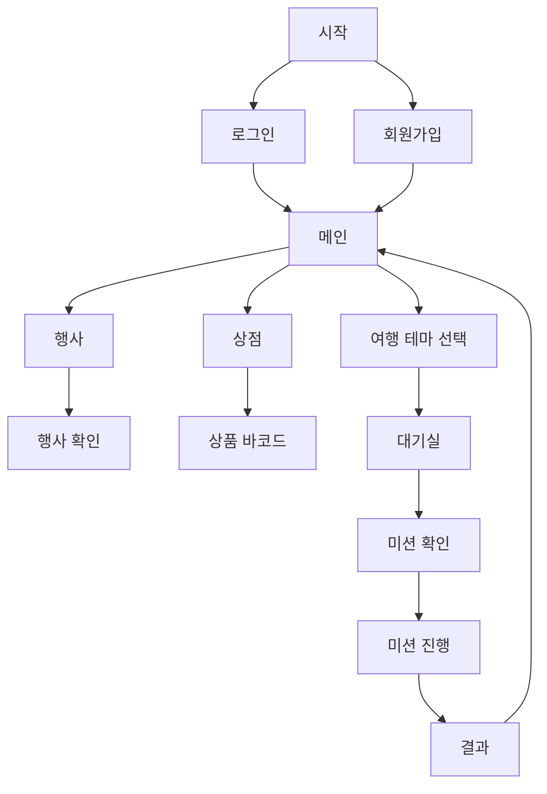

# 여행을 새롭게 즐기는 여행 어플리케이션 Tripting

 

## 선정 동기
천안에는 유명 관광지 외에도 잘 알려지지 않은 매력적인 장소들이 많습니다.
이 앱을 통해 사람들이 이런 숨은 명소들을 발견하고 방문할 수 있도록 도와
관광지에 대한 집중된 관심을 분산시키고, 새로운 여행 경험을 제공하기 위해
아이디어를 선정 했습니다.

## 프로젝트 소개

- **천안시 무작위 여행지 추천**  
  여행지의 사진과 정보를 제공하여 사용자들에게 흥미를 유발하고, 새로운 여행지를 추천합니다.

- **미션 및 보상 기능**  
  여행지와 연계된 미션 기능을 제공하고, 보상(포인트)을 지급하여 참여를 유도합니다.

- **지역 홍보 및 경제 활성화**  
  축제 정보와 천안시 특산품 교환 기능을 추가하여 지역을 홍보합니다.

## 프로젝트 구조

 

## 프로그램 실행 방법

1. **Frontend 및 Backend 시스템 환경 변수 설정**
2. **Tripting 레파지토리 Clone:**
    - Matster(최종) 브랜치 체크아웃 후, VS Code,IntelliJ 등에서 실행
    - npm install -leagcy-peer-deps 후 npm run android 실행
3. **백엔드 환경 설정:**
    - application.properties 에서 MongoDB 연동 후 MuKGeine.Application 실행
4. **안드로이드 에뮬레이터 실행:**
    -   TERMINAL에서 adb -s emulator-5554 reverse tcp:8080 tcp:8080 명령어 입력 후 locahost로 백엔드 연결 테스트
 
## 기술 스택

- **프론트엔드:** React Native, styled-components
- **백엔드:** Java 17, MongoDB
- **서버:** Amazon EC2, Apache
- **인공지능:** Azure AI Vision

## 협업 및 도구

- **버전 관리:** GitHub, GitHub Project
- **소통:** Discord, KakaoTalk, GitHub
- **디자인:** Figma

## 작업 관리

- **디스코드**및 **메일**을 활용한 작업 공유
- **주간 회의**를 통한 작업 방향성 고민 및 기록

### 프로그램 실행 화면 (시나리오 과정)

### 팀장

#### | **이승민** |

### 팀원

#### | **곽한얼** | **노현승** | **이재원** |
